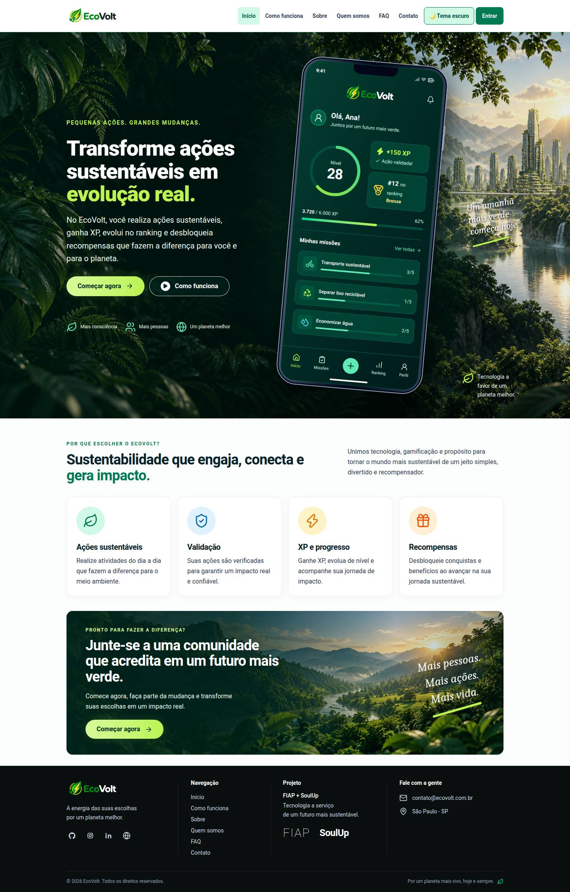
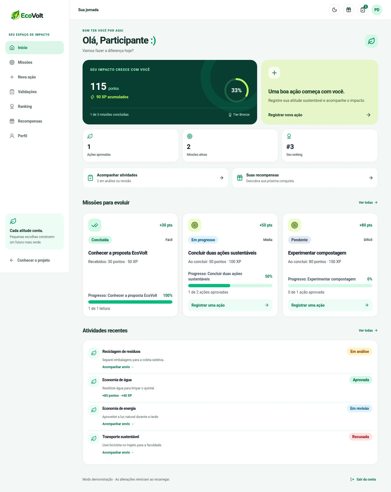
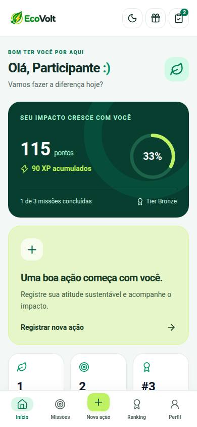

<p align="center">
  
</p>

<h1 align="center">⚡ EcoVolt — Transformando ações sustentáveis em impacto real</h1>

<p align="center">
  Pequenas ações. Grandes mudanças.<br />
  <strong>FIAP Challenge SoulUp 2026 · Front-End Design Engineering · Sprint 03</strong>
</p>

<p align="center">
  <a href="#como-executar">Executar o projeto</a> ·
  <a href="#previa-visual">Ver as telas</a> ·
  <a href="#equipe">Conhecer a equipe</a> ·
  <a href="https://github.com/Dev-Ulrich/EcoVoltRepositoryFE">Repositório</a>
</p>

> Plataforma web gamificada que conecta sustentabilidade, tecnologia e participação. Nesta Sprint, a experiência foi migrada para **React + Vite + TypeScript**, com navegação SPA, componentes reutilizáveis e dados demonstrativos compartilhados.
>
> **Escopo da entrega:** autenticação, ações, análise de evidências e recompensas são demonstrativas. Não há API de negócio, backend, upload real de vídeos ou resgate de benefícios.

---

## Sumário

- [Visão geral](#visao-geral)
- [Contexto e problema](#contexto)
- [Solução proposta](#solucao)
- [Funcionalidades](#funcionalidades)
- [Mecânica de gamificação](#gamificacao)
- [Sistema de validação](#validacao)
- [Tecnologias utilizadas](#tecnologias)
- [Arquitetura e estrutura](#arquitetura)
- [Páginas e rotas](#rotas)
- [Como executar](#como-executar)
- [Credenciais de teste](#credenciais)
- [Roteiro de demonstração](#demonstracao)
- [Qualidade e testes](#testes)
- [Prévia visual](#previa-visual)
- [Entregas relacionadas e roadmap](#roadmap)
- [Repositório e vídeo pitch](#repositorio-video)
- [Equipe](#equipe)
- [Contato e licença](#contato-licenca)

---

<a id="visao-geral"></a>
## 🌱 Visão geral

O EcoVolt propõe transformar hábitos sustentáveis em uma jornada de participação e reconhecimento. O usuário registra suas ações, acompanha validações e visualiza a evolução de pontos, XP, missões e conquistas.

A aplicação reúne uma **área institucional pública** e uma **área interna demonstrativa**. No celular, a área interna utiliza navegação inferior; no desktop, uma sidebar. As telas oferecem tema claro/escuro e animações que respeitam a preferência de movimento reduzido.

Esta versão substitui as páginas HTML independentes das etapas anteriores por uma Single Page Application. O conteúdo institucional apresenta a proposta do produto; os números do telefone ilustrativo da Home e os indicadores da comunidade não representam métricas reais nem o saldo da conta de teste.

<a id="contexto"></a>
## 🌍 Contexto e problema

Incentivar atitudes sustentáveis exige continuidade: campanhas isoladas nem sempre se tornam hábitos. A proposta do EcoVolt responde a quatro desafios:

- Manter as pessoas engajadas em atividades ambientais.
- Tornar o progresso individual compreensível.
- Reconhecer contribuições e estimular a participação recorrente.
- Construir um fluxo de evidências e revisão que possa apoiar a confiabilidade das ações.

<a id="solucao"></a>
## 💡 Solução proposta

O fluxo demonstrativo permite experimentar a jornada completa:

```text
Login → Registrar ação → Selecionar vídeo → Acompanhar análise
                                              │
                              ┌───────────────┴───────────────┐
                           Aprovação                        Recusa
                              │                               │
                     Pontos, XP e missões              Solicitar revisão
                                                              │
                                                       Nova análise simulada
```

Na solução idealizada, a avaliação poderá combinar regras, análise contextual, apoio de IA e revisão humana. **Essas avaliações reais não estão implementadas nesta entrega:** os resultados são escolhidos pelo usuário para demonstrar o comportamento da interface.

<a id="funcionalidades"></a>
## ✨ Funcionalidades

| Área | Recursos disponíveis |
|---|---|
| Institucional | Home, Sobre, Como Funciona, Quem Somos, FAQ e Contato |
| Acesso | Login com credenciais fictícias, mostrar/ocultar senha e logout |
| Dashboard | Pontos, XP, tier, posição no ranking, missões e atividades recentes |
| Ações | Seleção de categoria, descrição e evidência; busca e filtro de status |
| Validação | Detalhes por ID, aprovação/recusa simuladas e pedido de revisão |
| Missões | Progresso compartilhado e filtros por dificuldade/status |
| Ranking | Classificação mensal demonstrativa com filtro por tier |
| Recompensas | Catálogo de conquistas, requisitos e estados de disponibilidade |
| Perfil | Indicadores da sessão, contribuições por ODS e conquistas |
| Experiência | Temas, layouts responsivos, feedback de formulários e página 404 |

O formulário de contato valida os campos e exibe uma confirmação local. Nenhuma mensagem é enviada ou armazenada.

<a id="gamificacao"></a>
## 🏆 Mecânica de gamificação

### Pontos e XP

Cada aprovação concede a pontuação da categoria e **40 XP**. Missões concluídas acrescentam seus próprios bônus.

| Categoria | ODS associado | Pontos por aprovação |
|---|---:|---:|
| Reciclagem de resíduos | 12 | 70 |
| Economia de água | 6 | 85 |
| Transporte sustentável | 11 | 75 |
| Economia de energia | 7 | 90 |
| Compostagem orgânica | 12 | 80 |
| Plantio de árvores | 15 | 100 |

Aprovar novamente a mesma ação não concede pontos em duplicidade. As regras estão em [`src/data/demoState.ts`](src/data/demoState.ts).

### Missões

| Missão do cenário atual | Meta | Bônus |
|---|---|---|
| Conhecer a proposta EcoVolt | Leitura já concluída no cenário inicial | 30 pontos + 50 XP |
| Concluir duas ações sustentáveis | Duas ações aprovadas | 50 pontos + 100 XP |
| Experimentar compostagem | Uma compostagem aprovada | 80 pontos + 150 XP |

### Ranking e tiers

**Ferro → Bronze → Prata → Ouro → Diamante → Sustentabilístico**

A classificação demonstrativa é mensal, separada por tier e ordenada por pontos; empates são resolvidos pelo ID do participante. O tier da conta de teste permanece **Bronze**: promoção automática e reinício mensal não fazem parte desta versão.

### Recompensas

O catálogo apresenta Badge EcoStarter, Energia constante e um cupom sustentável conceitual. A disponibilidade acompanha os requisitos locais. Não há emissão de cupons, débito de pontos ou benefícios financeiros reais.

<a id="validacao"></a>
## 🔎 Sistema de validação

| Regra | Implementação atual |
|---|---|
| Evidência | MP4 (`video/mp4`), MOV (`video/quicktime`) ou AVI (`video/x-msvideo`) |
| Tamanho | Maior que zero e até 100 MiB, apresentados na interface como 100 MB |
| Descrição e justificativa | Entre 10 e 2.000 caracteres, validados no formulário |
| Recusa | Exige motivo com pelo menos 10 caracteres |
| Revisão | Disponível somente para ações recusadas |
| Resultado | Aprovação ou recusa escolhidas na análise simulada |
| Arquivo | Somente nome, tipo e tamanho são mantidos; não há upload, reprodução ou análise do vídeo |

### Persistência da demonstração

- **Navegar entre páginas:** preserva ações e alterações em memória.
- **Recarregar:** restaura os mocks de negócio.
- **Sair ou trocar de conta:** reinicia o estado demonstrativo.
- **Sessão:** somente o ID fictício fica no `sessionStorage`; a senha não é salva.
- **Tema:** preferência mantida no `localStorage`.

A autenticação demonstrativa não representa uma barreira de segurança de produção.

<a id="tecnologias"></a>
## 🛠️ Tecnologias utilizadas

| Tecnologia | Papel no projeto |
|---|---|
| React 19 + React DOM | Componentes e renderização da interface |
| TypeScript 6 | Tipagem de entidades, props, formulários e regras |
| Vite 8 | Servidor de desenvolvimento e build |
| Tailwind CSS 4 | Utilitários de estilização, responsividade e temas |
| React Router DOM 7 | Navegação SPA e rotas dinâmicas |
| React Hook Form 7 | Formulários de login, contato, envio e revisão |
| Lucide React | Ícones SVG |
| Context API + hooks | Compartilhamento da sessão e dos dados demonstrativos |
| Oxlint | Análise estática |
| Node.js Test Runner | Testes de autenticação e regras locais |
| Git + GitHub | Histórico e colaboração |

As versões resolvidas estão no [`package-lock.json`](package-lock.json). O Tailwind é integrado pelo plugin em [`vite.config.ts`](vite.config.ts); estilos globais e de animação estão em `src/styles/`.

<a id="arquitetura"></a>
## 🗂️ Arquitetura e estrutura

`AuthProvider` fornece a sessão fictícia. `DemoDataProvider` centraliza as transições com um reducer; as páginas acessam os dados pelo hook `useDemoData`. As regras permanecem em `data/demoState.ts`, separadas dos componentes visuais.

```text
EcoVoltRepositoryFE/
└── EcoVolt/
    ├── docs/
    │   ├── images/                  # Capturas usadas neste README
    │   └── PLANEJAMENTO-ANTERIOR.md  # Registro histórico
    ├── public/                     # Arquivos servidos diretamente
    ├── src/
    │   ├── assets/                 # Imagens: brand, public e team
    │   ├── auth/                   # Sessão e autenticação demonstrativa
    │   ├── components/
    │   │   ├── actions/            # Cards e apresentação de ações
    │   │   ├── app/                # Cabeçalhos da área interna
    │   │   ├── common/             # Botões, cards, campos e feedback
    │   │   ├── layout/             # Layouts, header, footer e navegação
    │   │   ├── missions/
    │   │   ├── ranking/
    │   │   └── rewards/
    │   ├── contexts/               # Estado compartilhado da demonstração
    │   ├── data/                   # Mocks, catálogos e regras
    │   ├── hooks/                  # Dados, tema e animações
    │   ├── pages/
    │   │   ├── public/             # Telas institucionais e login
    │   │   └── app/                # Telas internas da solução
    │   ├── routes/                 # AppRoutes.tsx
    │   ├── styles/
    │   ├── types/
    │   ├── App.tsx
    │   └── main.tsx
    ├── tests/                      # Autenticação e estado demonstrativo
    ├── .gitignore
    ├── .oxlintrc.json
    ├── index.html
    ├── package.json
    ├── package-lock.json
    ├── tsconfig.json
    ├── tsconfig.app.json
    ├── tsconfig.node.json
    ├── vite.config.ts
    └── README.md
```

<a id="rotas"></a>
## 🧭 Páginas e rotas

### Área pública

| Rota | Página |
|---|---|
| `/` | Home |
| `/como-funciona` | Fluxo e proposta da solução |
| `/sobre` | Contexto, propósito e ODS |
| `/quem-somos` | Integrantes, fotos e perfis |
| `/faq` | Perguntas, categorias e busca |
| `/contato` | Canais e formulário demonstrativo |
| `/login` | Acesso fictício |

### Área interna

| Rota | Página |
|---|---|
| `/app` | Dashboard |
| `/app/enviar-acao` | Registro de ação |
| `/app/validacoes` | Lista, busca e status dos envios |
| `/app/validacoes/:acaoId` | Detalhes e análise simulada |
| `/app/validacoes/:acaoId/revisao` | Solicitação de revisão |
| `/app/missoes` | Missões e progresso |
| `/app/ranking` | Ranking por tier |
| `/app/recompensas` | Catálogo de conquistas |
| `/app/perfil` | Indicadores e contribuições do participante |

Rotas internas exigem a sessão demonstrativa. Caminhos desconhecidos exibem a página 404; IDs de ações inexistentes apresentam um estado de indisponibilidade com retorno à listagem.

<a id="como-executar"></a>
## 🚀 Como executar

**Requisitos:** Node.js **24 ou superior**, npm e Git para clonar o repositório.

```bash
git clone https://github.com/Dev-Ulrich/EcoVoltRepositoryFE.git
cd EcoVoltRepositoryFE/EcoVolt
npm ci
npm run dev
```

Acesse o endereço exibido no terminal, normalmente `http://localhost:5173`. Se recebeu o projeto em ZIP, descompacte e execute os comandos na pasta que contém `package.json`.

### Build de produção

```bash
npm run build
npm run preview
```

O build é gerado em `dist/`. O preview normalmente atende em `http://localhost:4173`. A aplicação deve ser servida pelo Vite ou por um servidor configurado para SPA; abrir `index.html` diretamente não substitui esses comandos.

<a id="credenciais"></a>
## 🔑 Credenciais de teste

| Campo | Valor |
|---|---|
| E-mail | `demo@ecovolt.example` |
| Senha | `EcoVoltDemo2026` |

Na tela de login, o botão **Preencher dados de demonstração** preenche os campos. Clique em **Entrar** para abrir o dashboard. Utilize somente dados fictícios nesta experiência.

<a id="demonstracao"></a>
## 🎬 Roteiro de demonstração

1. Entre com as credenciais acima e confira o dashboard.
2. Abra **Nova ação** e selecione **Compostagem orgânica**.
3. Descreva a atividade em 10 a 2.000 caracteres e selecione um vídeo válido.
4. Clique em **Enviar para validação**; a ação fica **Em análise**.
5. Nos detalhes, informe um motivo e clique em **Simular recusa**.
6. Abra **Solicitar revisão**, preencha a justificativa e envie.
7. Nos detalhes da ação **Em revisão**, clique em **Simular aprovação**.
8. Confira a atualização no dashboard, missões, ranking, recompensas e perfil.
9. Experimente os filtros, a busca da FAQ, o formulário de contato e a troca de tema.
10. Saia da conta para encerrar a sessão e reiniciar a demonstração.

| Indicador | Cenário inicial | Após aprovar a nova compostagem |
|---|---:|---:|
| Pontos | 115 | 325 |
| XP | 90 | 380 |
| Ações aprovadas | 1 | 2 |
| Missões concluídas | 1 | 3 |
| Missões ativas | 2 | 0 |
| Posição no tier Bronze | 3º | 1º |

Nesse cenário, a compostagem concede **80 pontos + 40 XP**, e as duas missões atingidas acrescentam **130 pontos + 250 XP**. Outras categorias produzem resultados diferentes.

<a id="testes"></a>
## 🧪 Qualidade e testes

```bash
npm run lint
npm test
npm run build
```

| Comando | Verificação |
|---|---|
| `npm run lint` | Análise estática com Oxlint |
| `npm test` | 11 casos distribuídos em dois arquivos de teste |
| `npm run build` | Compilação TypeScript e geração da aplicação com Vite |

Os testes cobrem credenciais, sessão, imutabilidade dos mocks, envio, revisão, recusa, aprovação e atualização dos indicadores, incluindo prevenção de bônus duplicados. Eles não substituem a verificação visual das páginas.

Para revisão manual, percorra páginas públicas e internas, teste campos inválidos, navegação por teclado, telas pequenas, temas e IDs de ação inexistentes.

<a id="previa-visual"></a>
## 📸 Prévia visual

Capturas da versão React atual. O dashboard utiliza o cenário inicial da conta demonstrativa.

### Página inicial



### Dashboard



### Aplicativo no celular

<p align="center">
  
</p>

<a id="roadmap"></a>
## 🛤️ Entregas relacionadas e roadmap

### Implementado nesta versão

- [x] Migração para React, Vite e TypeScript.
- [x] Páginas públicas e internas com navegação SPA.
- [x] Componentes compartilhados e estado centralizado.
- [x] Login fictício e formulários principais validados.
- [x] Fluxo local de envio, análise e revisão.
- [x] Atualização de pontos, XP, missões e ranking.
- [x] Catálogo demonstrativo e perfil.
- [x] Responsividade, temas e animações com movimento reduzido.
- [x] Scripts de lint, testes e build.

### Contexto multidisciplinar

O Challenge também envolve modelagem de dados com Oracle, lógica com Python, orientação a objetos com Java, chatbot com IBM Watson Assistant e prototipação no Figma. Essas frentes pertencem às entregas complementares; não são serviços necessários para executar este frontend.

### Evoluções futuras da proposta

Autenticação de produção, persistência em banco, upload real de vídeos, análise automatizada/humana e integrações de benefícios são possibilidades futuras. Não são requisitos de execução da demonstração desta Sprint.

O [planejamento anterior](docs/PLANEJAMENTO-ANTERIOR.md) permanece como registro histórico; este README descreve a implementação atual.

<a id="repositorio-video"></a>
## 🔗 Repositório e vídeo pitch

- **Código da Sprint 03:** [EcoVoltRepositoryFE](https://github.com/Dev-Ulrich/EcoVoltRepositoryFE).
- **Versão anterior do frontend:** [EcoVolt-FrontEnd-Repository](https://github.com/Dev-Ulrich/EcoVolt-FrontEnd-Repository).
- **Vídeo pitch da Sprint 03:** [Video Pitch](https://youtu.be/r7tb51XaPgM).

<a id="equipe"></a>
## 👥 Equipe

Projeto desenvolvido pela equipe EcoVolt — **FIAP · Turma 1TDSPW**.

| Foto | Integrante | RM | Turma | Perfis |
|---|---|---|---|---|
|  | Victor Ulrich Costa Alves da Silva | 568634 | 1TDSPW | [GitHub](https://github.com/Dev-Ulrich) · [LinkedIn](https://www.linkedin.com/in/victorulrichcosta/) |
|  | Matheus Pereira da Silva Franco | 569315 | 1TDSPW | [GitHub](https://github.com/MatheusPSFranco) · [LinkedIn](https://www.linkedin.com/in/matheus-pereira-da-silva-franco-b7a7b03b7/) |
|  | Matheus Luca Fouad Barragão | 572228 | 1TDSPW | [GitHub](https://github.com/MatheusLuca) · [LinkedIn](https://www.linkedin.com/in/matheusbarragao/) |
|  | Arthur da Silva Santana | 571075 | 1TDSPW | [GitHub](https://github.com/arthursantana1521) · [LinkedIn](https://www.linkedin.com/in/arthur-da-silva-santana-a6061a310/) |

<a id="contato-licenca"></a>
## ✉️ Contato e licença

**Responsável:** Victor Ulrich Costa Alves da Silva<br />
**E-mail:** [victorulrich07@gmail.com](mailto:victorulrich07@gmail.com)<br />
**GitHub:** [Dev-Ulrich](https://github.com/Dev-Ulrich)

Projeto acadêmico para fins educacionais. Este repositório não declara uma licença de software aberta específica; uso e redistribuição devem respeitar as orientações da FIAP, do Challenge e dos autores.

---

<p align="center">
  <strong>EcoVolt</strong> — Tecnologia, pessoas e atitudes por um futuro mais verde.<br />
  © 2026 EcoVolt · FIAP Challenge SoulUp
</p>
